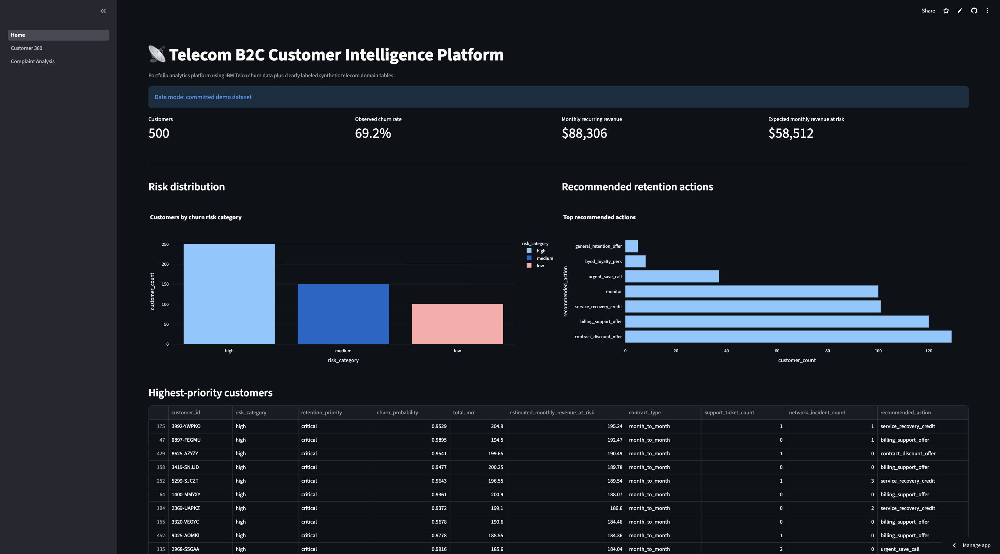
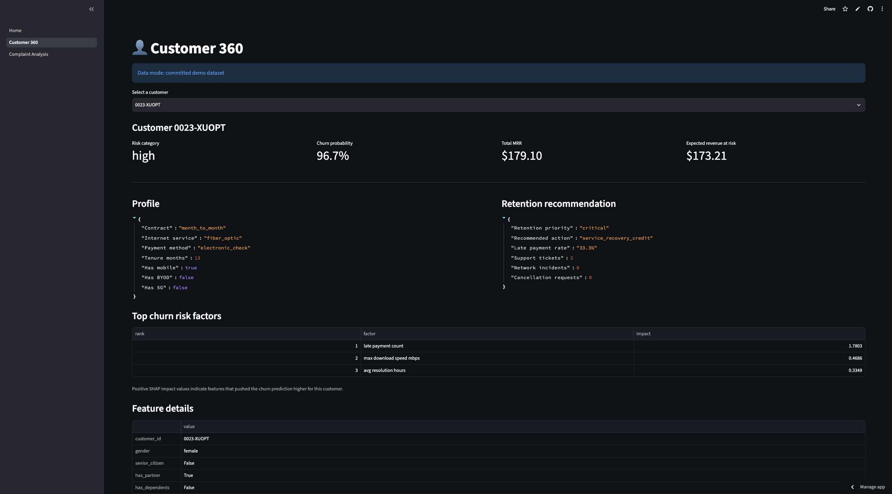
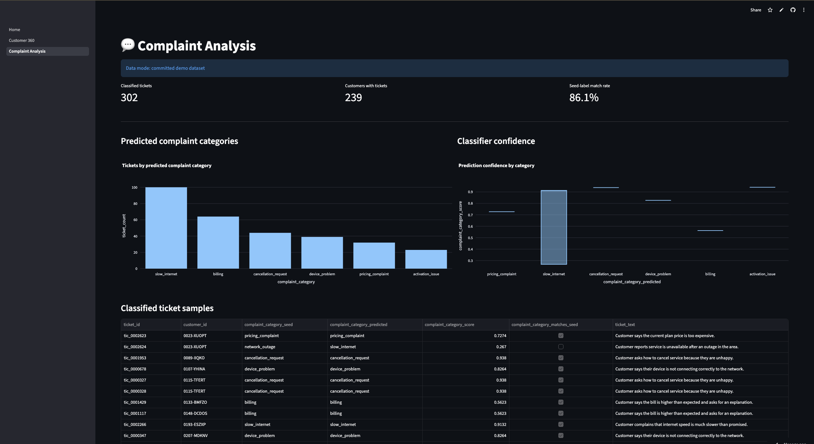
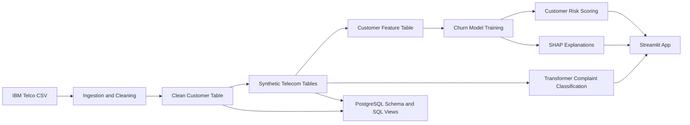

# Telecom B2C Customer Intelligence Platform

End-to-end telecom analytics and machine-learning platform for Customer 360, churn prediction, complaint intelligence, revenue-at-risk analysis, and retention prioritization.

## Live application

The deployed Streamlit application is available here:

[Telecom Customer Intelligence Platform](https://telecom-customer-intelligence-platformbranchmain-eat8m2wbwfv9c.streamlit.app/)

## Application screenshots

### Executive overview



### Customer 360 with SHAP explanations



### Complaint analysis



## Project overview

This project simulates a modern telecom customer intelligence platform for B2C fixed broadband, mobile, and BYOD customers.

It combines customer, subscription, billing, usage, network, support-ticket, NLP, and machine-learning outputs to answer questions such as:

- Which customers are most likely to churn?
- Which customer segments have the highest churn risk?
- How much monthly recurring revenue is at risk?
- Which complaints are associated with customer dissatisfaction?
- Which customers should receive retention outreach first?
- What factors are driving an individual customer's churn risk?

## Key features

- Reproducible ingestion and cleaning pipeline for the IBM Telco Customer Churn dataset
- Synthetic telecom domain data for mobile, fixed broadband, BYOD, usage, billing, network incidents, support tickets, and retention campaigns
- PostgreSQL schema and analytical SQL views
- Customer-level ML feature table
- Churn model training with Logistic Regression, Random Forest, and XGBoost
- Leakage prevention for label-derived revenue-at-risk fields
- Customer churn scoring and retention prioritization
- SHAP-based customer-level churn explanations
- Hugging Face Transformers zero-shot complaint classification
- Streamlit application with:
  - executive overview
  - Customer 360
  - churn probability
  - top churn risk factors
  - complaint analysis
  - retention recommendations
- Docker runtime for the app
- GitHub Actions CI for linting, SQL checks, and tests
- Model card and deployment documentation

## Data disclosure

The project uses the public IBM Telco Customer Churn dataset as the source foundation.

Additional telecom domain tables are synthetically generated for portfolio and demonstration purposes. Synthetic records are clearly labeled and should not be presented as genuine company data.

Generated local datasets under `data/raw/`, `data/interim/`, and `data/processed/` are intentionally ignored by Git. A small committed demo dataset under `data/demo/` allows the deployed Streamlit app to run publicly.

## Architecture


## Technology stack

| Area | Tools |
|---|---|
| Data processing | Python, Pandas, NumPy, PyArrow |
| Analytics | SQL, PostgreSQL-style schema/views |
| Machine learning | Scikit-learn, XGBoost |
| Explainability | SHAP |
| NLP | Hugging Face Transformers zero-shot classification |
| Application | Streamlit, Plotly |
| Deployment | Streamlit Community Cloud, Docker |
| Quality | Pytest, Ruff, GitHub Actions |
| Documentation | Markdown, model card, deployment docs |

## Repository structure

```text
app/                         Streamlit application
data/demo/                   committed demo data for deployment
docs/                        architecture, deployment, Docker, and model documentation
lookml/                      placeholder for BI semantic-model assets
models/artifacts/            ignored local model artifacts
notebooks/                   exploratory analysis notebooks
scripts/                     utility and validation scripts
sql/                         PostgreSQL schema and analytical views
src/telecom_intelligence/    reusable project package
tests/                       unit and integration tests
```

## Local setup
Create and activate a virtual environment, then install dependencies:
```bash
python -m pip install -r requirements.txt
python -m pip install -e .
```
Optional NLP dependencies for running the transformer classifier locally:
```bash
python -m pip install -r requirements-nlp.txt
```

## Run the Streamlit app

```bash
streamlit run app/Home.py
```
The app uses full local processed data when available. If generated local data is missing, it falls back to the committed demo dataset in data/demo/.

## Rebuild the local data pipeline
Download the IBM Telco source dataset into data/raw/, then run:

```bash
python scripts/profile_source_data.py
python -m telecom_intelligence.ingestion.clean_customers
python -m telecom_intelligence.synthetic.generate_telecom_data
python -m telecom_intelligence.features.build_customer_features
python -m telecom_intelligence.ml.train_churn_models
python -m telecom_intelligence.ml.score_customers
python -m telecom_intelligence.ml.explain_churn_predictions
python -m telecom_intelligence.nlp.classify_complaints
python scripts/build_demo_data.py
```
## Model performance
Latest local validation metrics for the selected churn model:

| Metric | Value |
|---|---:|
| ROC AUC | 0.9046 |
| Average precision | 0.7821 |
| Accuracy | 0.8446 |
| Precision | 0.7370 |
| Recall | 0.6444 |
| F1 | 0.6876 |

See [model_card.md](docs/model_card.md) for intended use, limitations, leakage prevention, and ethical considerations.

## Complaint classification
Support-ticket text is classified with Hugging Face Transformers zero-shot classification using a pretrained transformer model. NLP inference is run offline/local, and the deployed app reads precomputed demo outputs.
Latest local seed-label match rate:

```text
85.97%
```
## Docker
Build and run the app with Docker:
```text
docker build -t telecom-customer-intelligence .
docker run --rm -p 8501:8501 telecom-customer-intelligence
```
Open:
```text
http://localhost:8501
```
See [docker.md](docs/docker.md) for details.

## Quality checks
Run local validation:
```bash
ruff check .
python scripts/check_sql_files.py
pytest
```
GitHub Actions runs these checks automatically on pull requests and pushes to main.
## Deployment
The app is deployed on Streamlit Community Cloud.
Deployment notes are available in [deployment.md](docs/deployment.md).

## Current limitations
 
- The public IBM Telco dataset is a sample dataset, not live company data.
- Several telecom domain tables are synthetic.
The churn model has not been validated on real production telecom data.
- Transformer complaint classification is performed on synthetic ticket text.
- The deployed app uses a committed demo subset, not the full generated local dataset.
- Fairness, drift monitoring, and production governance are not implemented.

## Future improvements

- Add production-grade PostgreSQL loading
- Add drift monitoring and model-performance tracking
- Add richer retention-offer simulation
- Add more detailed customer segmentation
- Add screenshots and walkthrough video