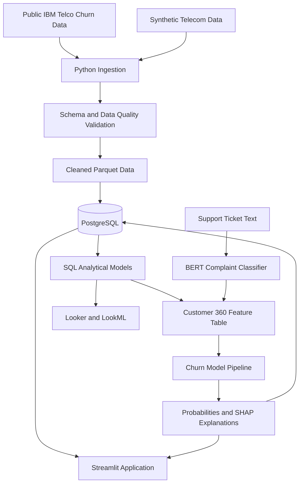

# Platform Architecture

## Purpose

The Telecom B2C Customer Intelligence Platform combines customer,
subscription, billing, usage, device, network, support, and retention data
to support KPI reporting, churn prediction, complaint classification, and
customer-level retention decisions.

## Data Disclosure

The foundational churn dataset is public sample data. Mobile, fixed broadband,
BYOD, usage, billing, network, support-ticket, and retention records are
synthetically generated for educational use. Synthetic records must never be
represented as genuine company data.

## Architecture

## Processing Layers

1. Raw layer: unchanged public and synthetic source records.
2. Validation layer: schema, uniqueness, null, range, and relationship checks.
3. Clean layer: standardized names, types, categories, and identifiers.
4. Analytical layer: reusable SQL models and telecom KPIs.
5. Feature layer: one prediction-time record per customer.
6. Prediction layer: churn probability, explanations, and retention priority.
7. Presentation layer: Looker dashboards and Streamlit application.

## Design Principles

- Preserve source data before transformation.
- Clearly label public and synthetic data.
- Use deterministic random seeds for synthetic generation.
- Enforce primary-key and foreign-key relationships.
- Keep business definitions in reusable SQL models.
- Prevent post-cancellation information from entering churn features.
- Train models offline and deploy lightweight inference artifacts.
- Store secrets outside version control.
- Make the application runnable locally and deployable from GitHub.
