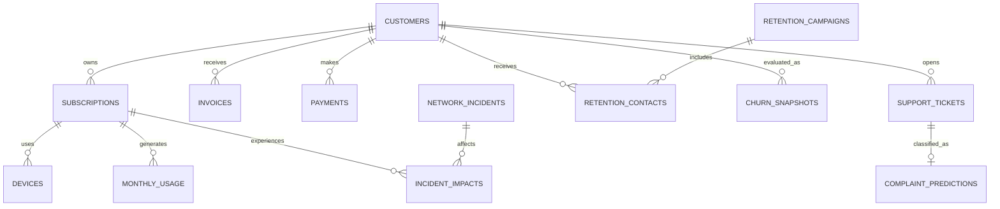

# Telecom Data Model

## Modeling Rules

- `customer_id` is the shared customer identifier.
- A customer may own multiple subscriptions.
- A subscription represents one mobile or fixed broadband service.
- Monthly tables use `snapshot_month` as their reporting period.
- Synthetic records must include `is_synthetic = true`.
- Prediction features must only use information available on the observation date.

## Core Tables

| Table | Grain | Primary Key | Purpose |
|---|---|---|---|
| customers | One row per customer | customer_id | Demographics, tenure, household, and churn status |
| subscriptions | One row per telecom service | subscription_id | Mobile and fixed broadband services |
| devices | One row per registered device | device_id | Handsets, modems, routers, and BYOD information |
| monthly_usage | One row per subscription per month | usage_id | Data, voice, SMS, and broadband consumption |
| invoices | One row per monthly invoice | invoice_id | Charges, discounts, taxes, and balances |
| payments | One row per payment transaction | payment_id | Payment status, method, and timeliness |
| network_incidents | One row per network incident | incident_id | Outages, degradation, severity, and duration |
| incident_impacts | One row per affected subscription and incident | impact_id | Connects incidents to customer services |
| support_tickets | One row per support case | ticket_id | Complaint text, category, and resolution |
| complaint_predictions | One row per classified ticket | ticket_id | NLP category, confidence, and sentiment |
| retention_campaigns | One row per campaign | campaign_id | Campaign definition and offer details |
| retention_contacts | One row per customer campaign contact | contact_id | Offer acceptance and campaign outcome |
| churn_snapshots | One row per customer observation date | snapshot_id | Churn label, probability, and risk classification |

## Relationships

## Service Types
The subscriptions.service_type field uses:
- mobile
- fixed_broadband
BYOD is not a separate subscription type. It is a device-ownership characteristic attached to a mobile subscription through devices.is_byod.

## Historical Design
The following tables preserve monthly or event history:
- monthly_usage
- invoices
- payments
- network_incidents
- incident_impacts
- support_tickets
- retention_contacts
- churn_snapshots
This allows the platform to calculate trends without overwriting previous states.

## Churn Observation Design
Each churn snapshot will contain:
An observation date

- A feature lookback period
- A future churn-label window
- The actual churn outcome
- Model probability
- Risk category
- Revenue at risk
- Retention priority
Features recorded after the observation date are prohibited to prevent target leakage.